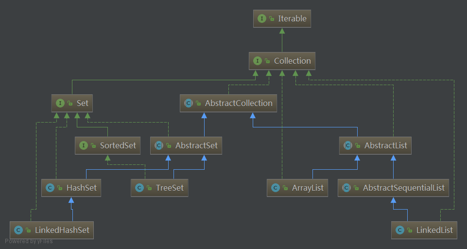
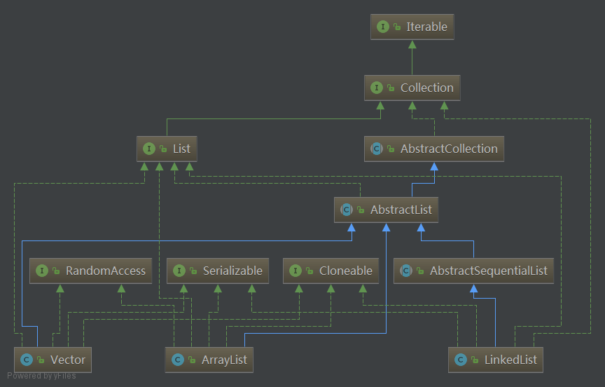

### JDK-Collection集合入门

* 总的list和set类结构大致如下所示

* Map不继承Collection,其结构如下

#### 首先介绍下迭代器的概念
* 迭代器无非是一个接口,假设我们有一个数组,如果我们要实现迭代器,只需要根据该接口定义的方法,返回对应结果而已.  
* 如下代码,是一个简化的ArrayList 加上简化的迭代器.
>
    class ArrayList<E> implements Iterable<E>{
        //每次扩容递增的大小
        private static final int INCREMENT = 10;
        //存储元素的数组
        private E[] array = (E[])new Object[10];
        //数组大小
        private int size;
        //增加方法
        public void add(E e) {
            if (size < array.length) {
                array[size++] = e;
            }
        }
        //返回长度
        public int size(){
            return size;
        }
        //返回迭代器类
        @Override
        public Iterator<E> iterator() {
            return new Itr();
        }
        //迭代器-内部类
        private class Itr implements Iterator<E> {
            //游标
            int cursor = 0;
            //判断是否有下一个元素
            @Override
            public boolean hasNext() {
                return cursor != size();
            }
            //返回下一个元素
            @Override
            public E next() {
                return array[cursor++];
            }
            //删除该元素
            @Override
            public void remove() {
                //doSomething
            }
        }
    }
>

* 如下是jdk中迭代器的真正定义.
* Iterable<T> : 可迭代接口.任何类的迭代器都需要通过实现该接口的Iterator<T> iterator()方法返回.
    * Iterator<T> iterator():返回一个迭代器
    * default void forEach(Consumer<? super T> action): Java8. 使用action.accept()消费每个元素,
        直到全部消费或抛出异常.
        >
            如下,其中的foreach()中传入的这个表达式可以理解为一个Consumer<? super T> action
            new ArrayList<>().forEach(item->{
            			System.out.println(item);
            		});
            只在此处稍微提及Java8相关点,其他Java8相关留后再议...
        >
    * default Spliterator<T> spliterator(): 创建Spliterator(可分割迭代器).一个fork/join的并行处理的迭代器,此处不详细展开.
* Iterator<E> interface: 迭代器接口,所有迭代器需要实现该接口.
    * boolean hasNext(): 判断是否有下一个元素
    * E next(): 返回下一个元素.如果没有.则抛出NoSuchElementException异常
    * default void remove(): 删除元素,在底层collection中.默认实现是抛出异常
    * default void forEachRemaining(Consumer<? super E> action):  对迭代器剩下的所有元素进行相同操作,直到完成或抛出异常.

#### 其他
* Collections.synchronizedSortedMap(SortedMap<K,V> m)之类的,将普通集合包装成同步集合的方法... 
其实现居然就是定义一个内部类,组合了传入的集合.然后定义了和该集合相同的一些增删改查的方法,然后直接调用传入的集合的方法,  
然后加上synchronized关键字而已...如下
>
    static class SynchronizedMap<K,V> {
        private final Map<K,V> m;//存储synchronizedSortedMap()方法传入的Map集合
        final Object      mutex;//作为锁对象.
        public V get(Object key) {synchronized (mutex) {return m.get(key);}}
        public V put(K key, V value) {synchronized (mutex) {return m.put(key, value);}}
    }
>

#### 下面介绍大部分集合(除Map外)的抽象,只需大致了解即可    
* Collection<E> interface: 所有集合的父类
    * int size(): 返回集合元素数量.如果大于Integer.MAX_VALUE,则返回Integer.MAX_VALUE
    * boolean isEmpty():集合是否是空的
    * boolean contains(Object o):如果该集合包含指定元素,返回true, 更准确的说,如果这个集合至少包含了一个该指定元素.
    * Iterator<E> iterator():返回一个迭代器
    * Object[] toArray():将所有元素转为数组,必须是新数组(没有其他引用)
    *  <T> T[] toArray(T[] a):如果传入的数组size>集合size,将所有元素放入该数组.否则返回一个新的集合数组.
        可以这样使用String[] y = x.toArray(new String[0]);相当于Object[] toArray()方法指定了返回类型
    * boolean add(E e): 新增元素,可根据集合自身,做一些例如非空/不可重复限制
    * boolean remove(Object o): 删除一个元素.
    * boolean containsAll(Collection<?> c):是否包含指定集合中的所有元素.
    * boolean addAll(Collection<? extends E> c):增加指定集合的所有元素到该集合
    * boolean removeAll(Collection<?> c):删除集合中和指定集合中的所有元素相同的元素
    * boolean retainAll(Collection<?> c): 在集合中,只保留指定集合中存在的元素.删除其他所有元素.
    * void clear():删除集合中的所有元素
    * boolean equals(Object o): 比较集合和另一集合是否相同.例如AbstractList中的实现是,按顺序比较
        两个集合中的每个元素是否相同.
    * int hashCode():返回集合的hashcode.例如AbstractList中的实现是,累加每个元素的hashcode.
    * default boolean removeIf(Predicate<? super E> filter)  : Java8接口默认实现方法.
            删除满足条件(filter.test()为true)的所有元素. filter可以理解为一个lambda表达式,返回boolean.
    * default Spliterator<E> spliterator() : 返回Spliterator<E>
    * default Stream<E> stream():返回  Stream<E> 
    * default Stream<E> parallelStream(): 返回Stream<E> ,并发的.

* AbstractCollection<E> abstract: 抽象集合类.集合接口的最小实现.对Collection接口做了稍许实现.
要实现一个不可修改的集合,只需要继承该类,然后实现iterator()和size()即可.(返回的迭代器必须实现hasNext()和next()方法)
要实现可修改的集合,必须重写add()方法,默认是抛出UnsupportedOperationException.并且返回的迭代器必须实现remove()方法
    * boolean isEmpty(): 实现:  return size() == 0;
    * boolean contains(Object o): 遍历集合每个元素,用equals和o比较.
    * Object[] toArray(): 遍历,将每个元素放入数组,最后使用 return Arrays.copyOf(r, i); 返回一个全新的数组. i为元素个数.
    * int MAX_ARRAY_SIZE : 对toArray()方法作的最大数组长度限制,值为Integer.MAX_VALUE - 8,-8是因为有些VM在数组头保留了一些信息.
    * <T> T[] toArray(T[] a): 类似,用了Array.newInstance()/Arrays.copyOf/System.arraycopy()方法
        >
            toArray方法可能会有比预期更多的元素(它是预先调用size()结果作为数组大小的.如果不符,应该是间隔间其他线程增加了元素),
            那么它在返回前会尽力保证和当前数据一致,所以再次判断了下,如果超出预期,则调用finishToArray()方法继续增加.
            并会用hugeCapacity()方法.最大限制其为Integer.MAX_VALUE,如果超出(Integer.MAX_VALUE + 1),则由0x7fffffff变为0x80000000,    
            最高位变为1,表示负数,所以.它判断其容量<0后,抛出OutOfMemoryError
        >
    * boolean add(E e):直接抛出UnsupportedOperationException
    * boolean remove(Object o): 迭代器遍历.依次比较,删除所有相同元素
    * boolean containsAll(Collection<?> c): 遍历,循环调用contains(Object o)方法.时间复杂度O(n^2).
    * boolean addAll(Collection<? extends E> c):遍历,循环调用add(E e).
    * boolean removeAll(Collection<?> c):遍历,循环调用remove(Object o),时间复杂度O(n^2).
    * boolean retainAll(Collection<?> c):遍历,循环调用c.contains(),时间复杂度O(n^2).
    * void clear(): 迭代,循环调用remove()方法.大多数实现会重写该方法(应该是将一个内部数组 == null)
    * String toString() :一个我们常见的toString实现.
   

#### List相关(包含Queue/Deque)

* List<E> interface: 一个有序集合,可通过整数索引查询元素.   
提供了一个特殊的迭代器ListIterator.允许元素的插入和替换.还允许双向访问Iterator接口提供的迭代器
    * default void replaceAll(UnaryOperator<E> operator) : 用运算操作的值替换每个元素
        >
            默认实现
            final ListIterator<E> li = this.listIterator();
                    while (li.hasNext()) {
                        li.set(operator.apply(li.next()));
                    }
            如果list实现不支持set操作,在操作第一个元素时将抛出UnsupportedOperationException
        >   
    * default void sort(Comparator<? super E> c): 排序.如果指定的比较器是空的,则元素必须实现Comparable接口
    * int indexOf(Object o): 返回元素最小的索引(第一次出现),没有则返回-1
    * int lastIndexOf(Object o): 返回元素最大的索引(最后一次出现),没有则返回-1
    * ListIterator<E> listIterator():返回特殊的list迭代器
    * ListIterator<E> listIterator(int index): 返回以指定元素开始的迭代器.
    * List<E> subList(int fromIndex, int toIndex):返回list指定索引间的list视图.不是新集合. 
        > 如果两个索引相同,则列表为空.  还有, 索引取头不取尾. 也就是 1,2 只会删除第2个元素(第二个元素索引为1)
        > 这样可以直接删除list中指定索引间的元素 list.subList(from, to).clear();
* ListIterator<E> interface: List接口特殊的迭代器,其实实现在每个list子类中 
    * 该接口实现了Iterator<E>接口
    * boolean hasPrevious(): 相反方向判断的hasNext(); 就是是否有前一个元素
    * E previous(): 返回前一个元素
    * int nextIndex(): 返回下一次调用next()的对象的索引,如果已经在最末尾,则返回list长度
    * int previousIndex(): 返回下一次调用previous()的对象的索引,如果已经在开头,则返回-1
    * void remove(): 删除当前元素,必须在调用next或previous后调用
    * void set(E e): 重新set当前元素的值.必须在调用next或previous后调用
    * void add(E e): 增加元素在当前位置.
    
* AbstractList<E>抽象的随机读写list类.如果需要顺序读写,AbstractSequentialList<E>抽象类应该比该类优先更好使.
    * Itr:实现了迭代器接口
    >
        抽象类中有一个modCount字段,保存该类修改操作次数.
        Itr中,expectedModCount变量保存当前迭代器对该类的修改操作次数.如果和modCount不符合,则抛出ConcurrentModificationException
        其主要迭代功能,依靠维护一个cursor索引变量,next()方法调用get(cursor)方法获取下一元素.
        又维护lastRet变量,保存最近一个通过next()方法获取的对象的索引,删除时调用remove(lastRet)方法.
    >
    * ListItr:实现list特殊的迭代器接口
    >
        可通过给cursor变量附初始值指定起始元素.
        其他的和Itr类似,只不过可以通过cursor 加减,来获取前一个或后一个元素.
        没有删除功能.通过add(i, e)和set()来修改/增加元素
    >
    * class SubList<E> extends AbstractList<E>: 该类维护了调用subList()方法后,从原list上切割的一段范围的list.
        但其实现不过是维护了原list.并限定了下标,使其无法操作范围外的元素而已.
    * RandomAccessSubList: 继承了SubList,实现RandomAccess接口,其他没有作任何扩展.只是为了在其他算法调用list时,能知道它是能随机读写的

* AbstractSequentialList<E> 抽象的顺序读写list类.
>
    该类的基本操作全部通过ListIterator迭代器完成.
    例如增加到指定索引. 通过返回一个指定索引开始的ListIterator.然后调用迭代器的add()方法完成增加.
    并且默认实现默认的ListIterator.
>

* Queue<E>接口:   
队列,也就是遵循FIFO(先进先出)原则的一种数据结构.只能在头部操作元素
>
    add:增加元素; offer:获取元素; 
    remove:删除并返回首元素,为空抛异常; poll:删除并返回首元素,为空返回null;
    element: 查看但不删除首元素,为空抛异常; peek:查看但不删除首元素,为空返回null;
>

* Deque<E>接口,继承Queue<E>接口:  
双向队列,可以在头部和尾部操作元素
>
    addFirst   addLast  offerFirst offerLast
    反正就这类头部尾部元素各种操作的方法.不赘述
>
    
* ArrayList<E> : extends AbstractList<E> implements List<E>, RandomAccess, Cloneable, java.io.Serializable    
    * 综述
    >   
        一个底层为Object[],然后通过System.arraycopy()等方法.操作扩容数组的一个集合.
        数据实际都存储在数组中,只不过在增加时,自动
        除了java8的方法外,还有SubList类(引用了自身,进行操作),其他没有什么特别的地方.
        
        如下是该类中的一个增加元素方法.其中的ensureCapacityInternal(size + 1)方法是
        实现数组增加容量的逻辑.可见其简单.
            public boolean add(E e) {
                ensureCapacityInternal(size + 1);  // Increments modCount!!
                elementData[size++] = e;
                return true;
            }
        
    >
    * 属性介绍
    >
        DEFAULT_CAPACITY = 10:初始容量 
        Object[] EMPTY_ELEMENTDATA = {} : 空list的表示,是真正的初始容量为0的空list
        Object[] DEFAULTCAPACITY_EMPTY_ELEMENTDATA = {}:空list的表示,是初始化的容量为10的空list
        elementData : 真正的元素数据,通常会比size大上一些,用来预扩容
        size: 真正存在的元素个数,可能小于elementData.length,可以使用trimToSize()方法去掉末尾空元素
            也就是说,调用后,elementData会删除预扩容的所有空元素.
        int MAX_ARRAY_SIZE = Integer.MAX_VALUE - 8 : 分配数组的最大大小.还有8个数字预留给特殊的VM(需要在数组头部保存一些信息)
        
        之前一直没考虑过为什么很多java库类都要为空专门定义一个对象.现在明白了.就是为了不重复的创建空对象.并可以明确的知道对象当前状态.
    > 
    * 扩容
    >
         ensureCapacity(int minCapacity) : 外部调用主动扩容,DEFAULTCAPACITY_EMPTY_ELEMENTDATA扩容只能是10.其他则不限制
         ensureCapacityInternal(int minCapacity) : 私有扩容方法.除了DEFAULTCAPACITY_EMPTY_ELEMENTDATA特殊.其他都是直接扩容.
         ensureExplicitCapacity(int minCapacity): 上面两个方法都调用该方法.确定最小容量大于当前容量后,即可扩容.
         grow(int minCapacity) : 真正实现扩容的方法. 取传入的最小容量 和 当前容量 + (当前容量 右移 1位)的最大值扩容.
            使用了Arrays.copyOf(elementData, newCapacity);方法实现数组复制和扩容.
         hugeCapacity(int minCapacity) : 防止容量超过最大值(如过超出了MAX_ARRAY_SIZE,直接扩容为Integer.MAX_VALUE),再超出后抛出异常
    >
    * 其他
    >
        每次从elementData中取出元素时,会向下转型(Object -> E)
        其底层操作elementData,大多通过System.arraycopy()方法
        clear()方法还是遍历elementData.循环赋值为null.不清楚为什么不直接将elementData == null.可能是为了GC效率?
        Itr:优化了AbstractList的迭代器.增加更细致的关于ConcurrentModificationException的判断
        ListItr:一样优化了下.
        
        以及一些关于java8的的方法.也就是Lamdba构建出对应的类,然后进行removeIf之类的操作.
        
        在随便说下,删除方法如下.
        public E remove(int index) {
            rangeCheck(index);//检查索引范围是否正确
    
            modCount++;//该对象修改次数递增
            E oldValue = elementData(index);//从数组中获取要被删除的对象.
            //elementData()方法就是从数组中根据索引获取元素,并向下转为对应泛型.
            
            //假设size为10,要删除最后一个元素(索引9),则为0,
            //假设size为10,要删除第8个元素(索引为7),则为2
            int numMoved = size - index - 1;
            //如果操作的不是最后一个元素.如下
            //  1234567091 这么一个数组,0是要删除的那个对象.如果它不再第一个,就需要将
            //  最后两个元素91 移动到 原来0的位置,就可以实现删除对象,并保证数组中间没有null.
            //  所以如下的方法,就是将这个数组的 要删除的index + 1 开始的 长度为 它的位置到结尾-1 .移动到 
            //  这个数组的 要删除的index 的位置........就是这样....
            if (numMoved > 0)
                System.arraycopy(elementData, index+1, elementData, index,
                                 numMoved);
            //此时数组 元素个数的最后一个元素,会为空. 注意,不是数组的最后一个元素
            //因为这个数组实际上是比目前存储的元素个数要大一些的.防止每次增加元素都去扩容.
            elementData[--size] = null;
            return oldValue;
        }
    >
* Vector<E> extends AbstractList<E> implements List<E>, RandomAccess, Cloneable, java.io.Serializable
    * 综述
    >
        一个和List极其相似的集合.
        它的扩容grow(int minCapacity)方法.在capacityIncrement变量(每次扩容增加量)大于0时,为capacityIncrement,小于等于0时,为当前容量的两倍
        并且大部分方法都使用了synchronized关键字
    > 
    
* LinkedList<E> extends AbstractSequentialList<E> implements List<E>, Deque<E>, Cloneable, java.io.Serializable
    * 综述
    >
        一个使用双链表的实现list和deque接口的集合.允许操作null元素
    >
    * 介绍
    >
        每个元素(节点)由静态内部类Node<E>构成,每个node包含  元素引用/上一node引用/下一node引用.如下:
            E item;
            Node<E> next;
            Node<E> prev;
        其中,首节点Node的prev为null,尾节点的prev为null.
        
        所以,遍历这个集合的方法如下. 从首节点开始,直到node.next为null.也就是尾节点.
            for (Node<E> x = first; x != null; x = x.next) {
                if (o.equals(x.item)) {
                    unlink(x);
                    return true;
                }
            }
         
        其中,如果要通过索引找到一个元素,需要如下,
        size>>1 的作用是判断要查找的索引是小于中间值还是大于中间值,据此判断是从头移动还是从尾移动.
                if (index < (size >> 1)) {
                    Node<E> x = first;
                    for (int i = 0; i < index; i++)
                        x = x.next;
                    return x;
                } else {
                    Node<E> x = last;
                    for (int i = size - 1; i > index; i--)
                        x = x.prev;
                    return x;
                }
        
        此外,它的迭代器原理类似,还有一个特殊的下行迭代器DescendingIterator,也就是在hasNext()方法中.使用hasPervious()
        
        它的toArray方法也是直接遍历,然后一次赋值到数组...        
    >
    * 属性
    >
        int size: 元素个数
        Node<E> first: 首节点
        Node<E> last: 尾节点
    >
    
#### Map相关
Key/Value映射对象,key不能包含重复的键,每个key指向一个value

* Map<K,V>: map接口,并不继承Collection<E>接口.map的最高级接口.
>
    特别的方法如下
    Set<K> keySet(): 返回key的set集合视图,也就是和SubList类似的维护了集合本身而已(SubList组合了创建它的list),所以map的修改会影响到这个set,反之亦然.
        如果map被修改,而set正在迭代(除非是迭代自己的remove操作),迭代的结果没有定义(????)
        该集合支持所有的删除功能.但不支持所有的增加功能.
    Collection<V> values(): 返回所有value的集合.同样的指向的是同一应用.其他同上.
    Set<Map.Entry<K, V>> entrySet(): 返回Entry<K,V>的set集合.其他同上
    
    default V getOrDefault(Object key, V defaultValue):key不存在时,返回默认值
    default V putIfAbsent(K key, V value) : key不存在时,才put
    default boolean remove(Object key, Object value) : 当key和value都为指定值时,才删除
    boolean replace(K key, V oldValue, V newValue) : 可以理解为CAS,当前值等于oldValue时,才替换
    还有一些java8相关的....暂时略过.
    
    内部接口
    Entry<K,V> : 一个key/value对.有getKey()/getValue()/setValue(V value)等方法
    该对象只能通过entrySet()方法获取.如果迭代时修改了map的值,则也是未定义(???).除非使用该接口内部修改的.
        可以获取key和value,修改value.其他还有些java8的.略过.
>
* AbstractMap<K,V> abstract  implements Map<K,V> : 抽象map类.最小化的实现了map接口
>
    基本操作的实现依靠的是 entrySet()返回的Set<Entry<K,V>>,然后调用.iterator()返回迭代器进行操作.例如如下get方法,key是要获取的元素的key
        Iterator<Entry<K,V>> i = entrySet().iterator();
        while (i.hasNext()) {
            Entry<K,V> e = i.next();
            if (key.equals(e.getKey()))
                return e.getValue();
        }
        
    该类维护如下两个变量
        transient Set<K>        keySet;
        transient Collection<V> values;
    然后keySet()和values()两个方法的实现极其相似.
    都是在第一次被调用时(通过判断如上两个变量是否为空,判断是否是第一次被调用,因为调用后会给变量赋值),
    分别创建匿名内部类AbstractSet和AbstractCollection.以及这两个抽象类内部的迭代器.
    并且,都了保存entrySet().iterator();返回的迭代器.让自己的内部迭代器的引用该迭代器.
    代码如下
        public Set<K> keySet() {
                Set<K> ks = keySet;
                if (ks == null) {
                    ks = new AbstractSet<K>() {
                        public Iterator<K> iterator() {
                            return new Iterator<K>() {
                                private Iterator<Entry<K,V>> i = entrySet().iterator();
                                public boolean hasNext() {return i.hasNext();}
                                public K next() {return i.next().getKey();}
                                public void remove() {i.remove();}
                            };
                        }
                        public int size() {return AbstractMap.this.size();}
                        public boolean isEmpty() {return AbstractMap.this.isEmpty();}
                        public void clear() {AbstractMap.this.clear();}
                        public boolean contains(Object k) {return AbstractMap.this.containsKey(k);}
                    };
                    keySet = ks;
                }
                return ks;
            }
            
    entrySet()方法为抽象方法.这也说明,该类的实现类,应该都是将数据真正保存在entrySet()中的.
    而所谓的keySet()和values()的结果都无非是将entrySet().iterator()返回的迭代器做了下封装.
    ....我之前看这个代码,没仔细看,一直觉得,上面那两个变量除了第一次调用这两方法时,后续并没有被改变过.
    是如何做到和集合当前的数据一致的....
    
    此外,该类实现了一个简单的Map.Entry<K,V>,名为SimpleEntry<K,V>.
    简单的维护了如下两个变量而已
        private final K key;
        private V value;
    有一点特别,setValue()方法,返回的是旧的value.
    
    还有一个SimpleImmutableEntry<K,V>.和SimpleEntry<K,V>的区别在于value也成final的.并且setValue()方法会直接抛出异常.
> 

* HashMap<K,V> extends AbstractMap<K,V> implements Map<K,V>, Cloneable, Serializable
    * 关于哈希表(hash table)
    >
        哈希表由数组实现.
        在普通数组中,我们存储元素的位置是随机的.例如我可以将"A"存在第3个元素,也可以存在第4个元素.元素和下标没有确定的关系.
        
        而哈希表中,存储的元素和数组下标有确定的关系.例如.存储一个班级的学生,如果将学生按学号(key)存储在对应下标的数组位置上,
        那么如果我们需要按照学号(key)查询学生,只需要 Student hash(int key){return students[key]};(hash()函数) 即可. 
        
        而这个表示key和元素存储位置之间的对应关系,可以成为 哈希函数. 按照这个思想创建的存储了学生的数据结构也就是哈希表.
        上述中,我们构造哈希函数的方法称为直接定址法.(取关键字或关键字的某一线性函数作为哈希)
        Hash(key)=key或Hash(key)=a*key+b.
        而上述中,正确的表示方式应该是 Hash(key)=key-1. 因为数组下标从0开始.
        
        通常,我们不会直接使用这种有线性关系的值作为key.例如使用学生姓名作为key,那么可以有多种策略(每个key对象的hashcode()方法).
        例如,取学生的姓氏的ASCII码(hashcode),然后对10取余.或者累加学生姓名的每个字的ASCII码,对10取余;存储在数组对应下标位置.
        但是,这样可能会产生多个同学的key生成的哈希地址一样的情况(这种情况被称为同义词).
        
        那么.最常见的处理方式是链地址法(HashMap中就就使用了该方法).定义一个每个元素都是一个链表的数组.数组长度为哈希地址的区间(此处对10取模,也就是0-9);
        那么将同义词的学生存储在同一个数组位置的链表中即可(每次新增都追加在链表的首位或末尾,链表是无界的.);
        
        那么哈希表就是通过一个哈希函数Hash(key)和处理冲突方法将一个关键字映射到一个连续的地址集(数组)上，并以关键字的某种策略
        作为记录在表中的存储位置。
        
        哈希函数的几种常见策略:
            1. 直接定址法:Hash(key)=key或Hash(key)=a*key+b. 就像上面说的根据学号来定存储位置
            2. 取模法:Hash(key)=key MOD p, p<=m(m为哈希表长). java中为(key % p)
            3. 数字分析法: 取key中的若干位组成哈希地址.例如一个key:17826824998. 可以取其中的第一个数字和最后一个数字,组成两位数..作为哈希地址.
            4. 平方取中法:取关键字平方后的中间若干位组成哈希地址.
        由此可见.key最后都需要为数字,即使是String,也要先转为数字(见hashcode()方法)
        
        哈希表处理冲突的几种常见方法:
            1. 链地址法:如上所述;
            2. 开放地址法: 如果遇到同义词,就换一个哈希地址尝试. 例如,key的hashcode为10,数组长度为20; 10%20得到哈希地址,如果冲突,将10+1再次尝试.
            3. 再哈希法: 例如key的hashcode冲突,就换一种方法计算hashcode.直到不冲突.
            4. 建立公共溢出区: 在基础表的基础上多增加一个溢出表(可以为数组之类的.);不冲突,就直接存在基础表中,冲突了.放入溢出表.查询时先查询基础表,再查询溢出表.
        
        其增删查元素的时间复杂度都为O(1);(可以简单的理解为只需要一层循环,如果是O(2)就是两层嵌套循环....)    
    >
    * 综述
    >
        
    >
    * 介绍
    >
        基于HashTable的Key/Value结构.key和value都可为null.
        与HashTable大致相同.除了它取消同步,允许空值.不保证顺序.
        迭代所需时间和容量成正比,所以初始容量不宜太高(或load factor过低).
        
    >
    * 属性/方法等
    >
        static final int DEFAULT_INITIAL_CAPACITY = 1 << 4;// 默认初始容量, 16,这样表示保证了其必须是2的x次方.
        static final int MAXIMUM_CAPACITY = 1 << 30;//最大容量,限制自己指定的初始容量必须小于该值,必须是2的x次方且小于2的30次方.
        static final float DEFAULT_LOAD_FACTOR = 0.75f;//默认负载因子
        static final int TREEIFY_THRESHOLD = 8;//一个桶中,使用treeNode的阈值,当bin个数大于该值后,节点由hash table转为tree node.
        static final int UNTREEIFY_THRESHOLD = 6;//一个桶中,不再使用treeNode的阈值,要小于TREEIFY_THRESHOLD.当bin个数小于该值后,tree node 转为 hash table
        static final int MIN_TREEIFY_CAPACITY = 64;//当表的容量超过该值时,桶中的bin才能转为树,否则即使超过后,也只是扩容.
        static class Node<K,V> implements Map.Entry<K,V> : 基本的哈希bin节点.用于大多数Entry.定义有如下属性
                    final int hash;//该节点的hash值
                    final K key;
                    V value;
                    Node<K,V> next;//指向的下一个节点,因为HashMap的实现是链地址法,所以每个节点会存储下一节点的引用
                    稍微特别的是其hashCode() {return Objects.hashCode(key) ^ Objects.hashCode(value);}方法
                    其中^操作数字表示按位异或(二进制并排,上下比较,相同为0,不同为1;此外,按位与(&)表示都为1时才为1.按位或(|)表示有一个为1就为1)
        以上是所有static
        
        Class<?> comparableClassFor(Object x):判断x这个类是否实现了Comparable<(x的类型)>接口.如果实现了或者x的类型是String,那么返回x的Class<?>.否则返回null
        int compareComparables(Class<?> kc, Object k, Object x):如果x为null或x的类型不为kc,返回0,否则返回((Comparable)k).compareTo(x);k和x的比较结果
        int tableSizeFor(int cap):其作用是,返回一个是2的x次方的,比cap大的,但是又最接近cap的整数.例如cap=10,返回16;cap=17,返回32;
        transient Node<K,V>[] table;//存储元素的数组(哈希表).第一次初始化时使用,必须使用resize()方法
        transient Set<Map.Entry<K,V>> entrySet;// 保存缓存的entrySet()的结果.
        transient int size;//元素个数
        transient int modCount;//修改次数(主要用于保证线程安全的快速失败使用)
        int threshold;//下一次使用resize()方法后的容量大小(容量*负载因子) 如果没有分配Node<K,V>[] table,会为0,表示DEFAULT_INITIAL_CAPACITY(默认初始容量)
            该属性的赋值全是通过int tableSizeFor(int cap)方法的结果
        final float loadFactor;//负载因子
        
        以下为public
        public HashMap(int initialCapacity, float loadFactor) : 指定初始容量和负载因子构建空的HashMap.
        

            
        
        
        
    >
    * 其他
    >
        
    >
    * 注意点
    >
        它通常作为一个二进制的hash table.当时当数据过大,就变为了TreeNode,每个结构类似于TreeMap.
    >

    
#### Set相关-本来先看set...结果我忘了HashSet的实现是靠HashMap....
不包含重复元素的集合,因此最多存在一个null元素.

* Set<E> extends Collection<E> :  set接口,只是一个声明而已,没有任何实现,也没什么特别的方法

* AbstractSet<E> extends AbstractCollection<E> implements Set<E> : 抽象set类,也没什么特别的方法

* HashSet<E> extends AbstractSet<E>  implements Set<E>, Cloneable, java.io.Serializable : hashSet 保存了hashcode.无序,允许元素为null
    * 综述
    >
    
    >
    * 介绍
    >
    
    >
    * 属性
    >
    
    >

